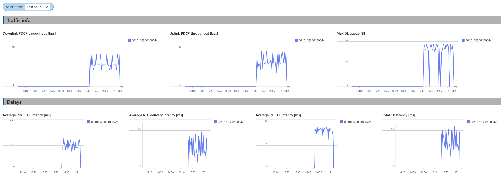

- [1. Dashboard application](#1-dashboard-application)
  - [1.1. Prepare codelets](#11-prepare-codelets)
  - [1.2. Create the dashboard](#12-create-the-dashboard)
  - [1.3. Run the example](#13-run-the-example)
    - [1.3.1. Terminal 1](#131-terminal-1)
    - [1.3.2. Terminal 2](#132-terminal-2)
    - [1.3.3. Terminal 3](#133-terminal-3)
    - [1.3.4. Terminal 4](#134-terminal-4)
      - [1.3.4.1. Expected output:](#1341-expected-output)
  - [1.4. Unloading app](#14-unloading-app)
  - [1.5. View dashboard on Azure](#15-view-dashboard-on-azure)


# 1. Dashboard application

 
The dashboard application collects various statistics at different levels of RAN, including throughput and latency at PDCP and RLC level, packet retransmissions at the MAC level, spectrum utilization at the PHY level, etc. 

This application consists of multiple codelets and a python application running inside jrt-controller (for details, see [here](../jrtc_apps/dashboard/deployment.yaml)).


## 1.1. Prepare codelets

The dashboard uses most of the sample codelets, so you'll need to build them all:
```
cd ~/jrtc_apps/codelets
./make.sh 
```
*Note: when this is run you'll see output similar to the following* ...

```sh
ERROR: /nanopb/pb.h:216: Syntax error at '1'
ERROR: /nanopb/pb.h:384: Syntax error at 'sizeof'
ERROR: /usr/include/sys/cdefs.h:298: Syntax error at '\n'
ERROR: /usr/include/sys/cdefs.h:325: Syntax error at '\n'
...
...
WARNING: Could not parse macro "#define t_ta_hist_init_default { 0 , 0 }"
WARNING: Could not parse macro "#define t_pwr_hist_init_default { 0 , 0 }"
...
...
ERROR: Undef "NULL" depends on an unknown identifier "NULL". Undef "NULL" will not be output
ERROR: Undef "NULL" depends on an unknown identifier "NULL". Undef "NULL" will not be output
INFO: Status: Writing to fapi_gnb_rach_stats.py.
INFO: Status: Wrapping complete.
--------- fapi_gnb_rach_stats_collect.cpp ----------------------------------------------
clang++ -O2 -target bpf -Wall -std=gnu++17 -DJBPF_EXPERIMENTAL_FEATURES -DJBPF_DEBUG_ENABLED -D__x86_64__ -fpermissive -Wno-incompatible-pointer-types -Wno-pedantic  -I/src/out/inc -I/src/include -I/nanopb -I/src/external -I/src/external/fmt/include -I/usr/include/c++/13.2.0 -I/usr/include/c++/13.2.0/x86_64-pc-linux-gnu  -c fapi_gnb_rach_stats_collect.cpp -o fapi_gnb_rach_stats_collect.o
/src/out/bin/srsran_verifier_cli fapi_gnb_rach_stats_collect.o || echo "fapi_gnb_rach_stats_collect.cpp: Failed verification"

48:53: Code is unreachable after 48:53
56:61: Code is unreachable after 56:61
60:177: Code is unreachable after 60:177
94:61: Code is unreachable after 94:61
151:61: Code is unreachable after 151:61

1,0.077681
Program terminates within 2067 instructions
```
These errors toward the top can actually be ignored.  They are output by the "ctypesgen" command, but are not issues that have any impact.  The codelet's compilation/verification result is shown in the lines ...
```sh
1,0.016758
Program terminates within 333 instructions
``` 
When this starts with "1," it means it is successful.  In failures cases, it will start with "0,".


## 1.2. Create the dashboard

We will use Azure Log Analytics dashboard to vizualize the results. 
You can create a free Azure account and create a Log Analytics instance on it. 

Once you created the Log Analytics instance, you will need its credentials. 
On Azure portal, go to the instance, select *Settings/Agents* and then *Log Analytics agent instructions*. 
There, you will find the workspace ID and primary key. 

Create an additional `azure.yaml` file with these credentials. 
```
jrtc_controller:
  log_analytics:
    enabled: true
    workspace_id: "PUT_WORKSPACE_ID_HERE"
    primary_key: "PUT_PRIMARY_KEY_HERE"
```
Add `-f azure.yaml` to the command line when loading the Helm chart. 


## 1.3. Run the example

Open four seperate terminals.
In each window, set up the environment variables as described [here](../README.md#Preparing-the-Environment).

The srsRAN and JRTC are started as shown [here](../README.md#Start-the-srsRAN).

### 1.3.1. Terminal 1

Monitor the srsRAN logs:
```
kubectl -n ran logs -f srs-gnb-du1-0 -c gnb
```

### 1.3.2. Terminal 2

Monitor the jrt-controllerc logs:
```
kubectl -n ran logs -f jrtc-0
```

### 1.3.3. Terminal 3

Montor the jrt-decoder logs:
```
kubectl -n ran logs -f jrtc-0 -c jrtc-decoder
```

### 1.3.4. Terminal 4

Load the codelet:
```
cd ~/jrtc_apps/jrtc_apps
./load.sh -y xran_packets/deployment.yaml
```

#### 1.3.4.1. Expected output:

Once the codeletSet is loaded successfully, one should see the following logs in the jrtc log output: 
```
2025-06-11T09:11:35.143918+00:00 : {'timestamp': 1749633095045963264, 'stream_index': 'JBPF_STATS_REPORT', 'meas_period': 1000000, 'perfs': [{'hook_name': b'fapi_ul_tti_request', 'num': 603, 'min': 26, 'max': 1469, 'hist': [0, 0, 0, 0, 51, 46, 67, 303, 120, 15, 1, 0, 0, 0, 0, 0, 0, 0, 0, 0, 0, 0, 0, 0, 0, 0, 0, 0, 0, 0, 0, 0, 0, 0, 0, 0, 0, 0, 0, 0, 0, 0, 0, 0, 0, 0, 0, 0, 0, 0, 0, 0, 0, 0, 0, 0, 0, 0, 0, 0, 0, 0, 0, 0]}, {'hook_name': b'fapi_dl_tti_request', 'num': 1613, 'min': 26, 'max': 1641, 'hist': [0, 0, 0, 0, 180, 291, 344, 465, 311, 18, 4, 0, 0, 0, 0, 0, 0, 0, 0, 0, 0, 0, 0, 0, 0, 0, 0, 0, 0, 0, 0, 0, 0, 0, 0, 0, 0, 0, 0, 0, 0, 0, 0, 0, 0, 0, 0, 0, 0, 0, 0, 0, 0, 0, 0, 0, 0, 0, 0, 0, 0, 0, 0, 0]}]}
```
Note that there will be different outputs for different types of statistics. 


## 1.4. Unloading app

To unload the codelet, run the following command:

```
cd ~/jrtc-apps/jrtc_apps
./unload.sh -y xran_packets/deployment.yaml
```


## 1.5. View dashboard on Azure

Log onto your Azure Log Analytics portal and go to the Monitoring/Workbooks option. 
Create a new workbook. You should be in the edit mode now. 
In the top bar, choose the Advance Editor option with sign `</>`. 
Choose Gallery Template, delete the existing text and copy [dashboard.json](../jrtc_apps/dashboard/dashboard.json) content into the window, Apply and Save. 
This should show you the dashboards. 

Initially, it will take a few minutes for Log Analytics to parse the data and create tables after you started a RAN and created some traffic. 
After that, the data will keep appearing almost instantaneously. 
You can also explore data using KQL language through a Log option. 
The dashboard graphs are also defined in KQL. You can further modify each graph by editing its KQL query. 

A part of a sample dashboard is shown in the figure below .
The Traffic section info shows PDCP throughput and queue size in bytes on the downlink in PDCP. 
The Delay section shows various delays (see [here](./srsran_hooks.md) for more info on what is measured).

The UEs are indexed by IMSIs (if available) or TIMSIs. If none is present, data is not displayed. 
The dashboard jrtc [app](../jrtc_apps/dashboard/dashboard.py) collects data from various codelets and creates mapping between various identifiers (e.g. RNTI, UE ID, TMSI, etc).
Different IDs are appended to each output so all outputs can be indexed by different IDs. 

Some IDs change more often (like RNTI) and some less often (like TIMSI), but no ID visible inside RAN can identify a UE uniquely. 
For this one needs the IMSI-TIMSI mapping form the core. 
We have modified Open5GS to provide these mapping to jrt-controller whenever available, and our dashboard app adds IMSIs to the ID set. 
If you don't use the modified Open5GS, the dashboard will classify data based on TIMSIs. 


