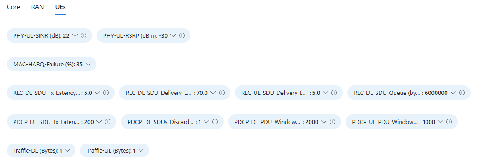
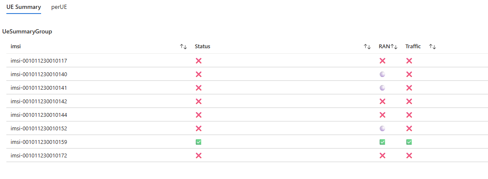
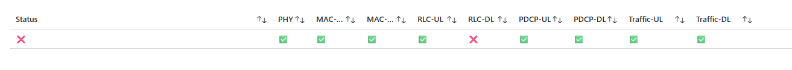
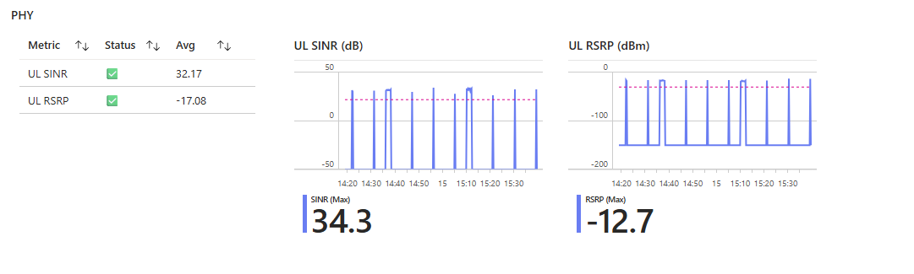
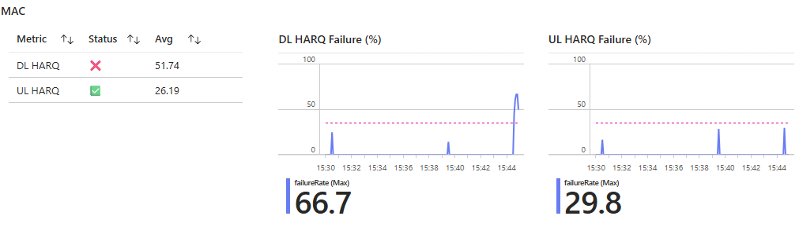
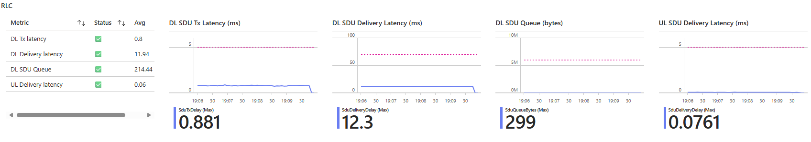
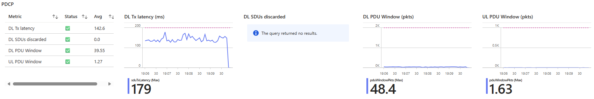
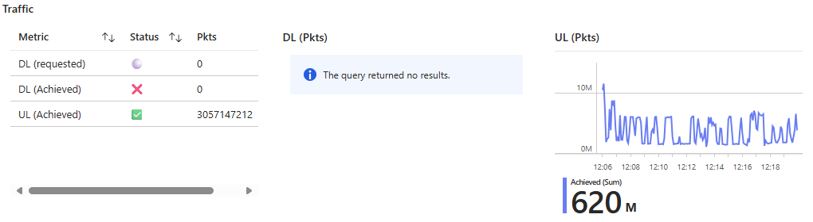

- [1. Status summary dashboard](#1-status-summary-dashboard)
- [2. Platform](#2-platform)
- [3. Core](#3-core)
- [4. RAN](#4-ran)
- [5. UE](#5-ue)
  - [5.1. Thresholds](#51-thresholds)
  - [5.2. Icons](#52-icons)
  - [5.3. UE Summary](#53-ue-summary)
  - [5.4. perUE](#54-perue)
    - [5.4.1. Status](#541-status)
    - [5.4.2. PHY](#542-phy)
    - [5.4.3. MAC](#543-mac)
    - [5.4.4. RLC](#544-rlc)
    - [5.4.5. PDCP](#545-pdcp)
    - [5.4.6. Traffic](#546-traffic)
  - [5.5. Debugging hints](#55-debugging-hints)
    - [5.5.1. Radio link Performance](#551-radio-link-performance)
    - [5.5.2. Network Congestion](#552-network-congestion)

# 1. Status summary dashboard

The Status Summary Dashboard is designed to give users a high-level overview of the testbed’s performance. It allows users to monitor the status of key components such as the Platform (e.g., servers, Kubernetes pods), Core, RAN, and individual UEs.

Each section provides a functional or non-functional status, offering quick insight into system health.

This README includes details on the meaning of the results and practical steps users can take to improve performance.

If deeper analysis is required, testbed maintainers can use the dashboard as a starting point to investigate and troubleshoot issues.

# 2. Platform

tbd

# 3. Core

tbd

# 4. RAN

tbd

# 5. UE

This section provides information about UEs that were active during the time range selected at the top of the dashboard.

The UE section is divided into two tabs:
- __UE Summary__ – Offers a high-level overview of all UEs.
- __perUE__ – Presents detailed performance and status information for an individual UE selected by the user.

## 5.1. Thresholds

A set of predefined thresholds is used to evaluate whether each UE is operating within acceptable performance levels.

The thresholds are defined as follows:

| **Metric**                         | **Threshold** | **Description**                                                                 |
|-----------------------------------|---------------|---------------------------------------------------------------------------------|
| **PHY-UL-SINR (dB)**              | 22            | Minimum acceptable uplink Signal-to-Interference-plus-Noise Ratio.             |
| **PHY-UL-RSRP (dBm)**             | -35           | Minimum uplink Reference Signal Received Power.                                |
| **MAC-HARQ-Failure (%)**          | 35            | Maximum tolerable HARQ failure rate.                                           |
| **RLC-DL-SDU-Tx-Latency (ms)**    | 5.0           | Maximum latency for transmitting DL SDUs from RLC to MAC.                      |
| **RLC-DL-SDU-Delivered-Latency (ms)** | 70.0       | Maximum end-to-end latency for DL SDU delivery to the UE.                      |
| **RLC-UL-SDU-Delivered-Latency (ms)** | 70.0       | Maximum latency for UL SDUs delivered to the gNB.                              |
| **RLC-DL-SDU-Queue-Size (bytes)** | 5.0           | Maximum average size of the DL SDU queue. High values may signal congestion.   |
| **PDCP-DL-SDU-Tx-Latency (ms)**   | 200           | Max allowed latency for transmitting DL SDUs from PDCP to RLC.                 |
| **PDCP-DL-SDUs-Discarded**        | 1             | Max number of discarded SDUs at PDCP.                                          |
| **PDCP-DL-PDU-Window-Pkts**       | 2000          | Max size of PDCP DL transmission window (in packets).                          |
| **PDCP-UL-PDU-Window-Pkts**       | 1000          | Max size of PDCP UL transmission window (in packets).                          |

Each metric is evaluated against these thresholds over time. Persistent violations are flagged in the per-UE performance dashboard and can help pinpoint whether issues stem from radio conditions, retransmissions, queuing, or other performance bottlenecks.

## 5.2. Icons

There are 3 icons used to convey the results :-

✅ - The UE meets the expected performance criteria.

❌ -  The UE does not meet one or more performance criteria.

⚪ -  No Data – No relevant statistics were received to assess performance.

## 5.3. UE Summary

This tab provides a general overview of all UEs that have successfully attached to the Core network. UEs are identified by their IMSI.

Each UE is evaluated based on the following criteria:

- __Status__ – Represents the overall status of the UE, derived from the combination of RAN and Traffic results.

- __RAN__ – Indicates whether the UE is performing well at the RAN level. This includes metrics such as signal power, PHY layer retransmissions, and other radio-level indicators.

- __Traffic__ – Reflects whether both uplink and downlink application data have been successfully transmitted.

In the example shown, IMSI 001011230010159 was the only UE classified as performing satisfactorily based on the combined RAN and Traffic evaluations.

## 5.4. perUE

This tab provides detailed statistics for an individual UE.

To begin, the user must select an __IMSI__ from a drop-down list that is automatically populated.
If an IMSI is not listed, it means that the UE was not attached to the network during the selected time period.

This tab is divided into multiple sub-sections, described below.

### 5.4.1. Status

For the selected UE, results are provided for the following functional areas:

- __Status__ – Represents the overall status of the UE, derived from the combination of all the individual functional area results.
- __PHY__ – Indicates whether the UE is performing well at the physical layer (e.g., signal strength, retransmissions).
- __MAC-Uplink__ – Evaluates uplink performance at the MAC layer.
- __MAC-Downlink__ – Evaluates downlink performance at the MAC layer.
- __RLC-Uplink__ – Indicates uplink performance at the RLC layer.
- __RLC-Downlink__ – Indicates downlink performance at the RLC layer.
- __PDCP-Uplink__ – Evaluates uplink performance at the PDCP layer.
- __PDCP-Downlink__ – Evaluates downlink performance at the PDCP layer.
- __Traffic-Uplink__ – Measures successful transmission of application-layer uplink data.
- __Traffic-Downlink__ – Measures successful reception of application-layer downlink data.

Each of these is independently evaluated and displayed using standard status icons (✅, ❌, ⚪) to indicate success, failure, or no data.

In the example below, the UE performed adequately across all functional areas __except__ for __RLC-Downlink__.

As a result of this failure, the overall Status is marked as ❌.

For each of the sections below, there are a numerous visualisations.

For each metric, the average value over the selected time period is compared against its corresponding threshold and marked using the standard status icons (✅, ❌, ⚪).

The __visualisation on the left__ provides a summary: each row displays the metric name, its status icon, and the calculated average value.

The __time-series plots__ on the right show how each metric varied over the selected time window.   
Also plotted as a dashed line representing the correspondng threshold.

Note: if no data was collected for a given metric during this period, the plot will be empty and the status will be marked as ⚪.  
To generate these plots, the total time range is divided into <n> time slots, and the average value within each slot is computed and plotted.
If a specific time slot contains no data, a __default value__ is used to maintain continuity in the visualization.

### 5.4.2. PHY

This section provides statistics related to the UE’s performance at the PHY (Physical) layer.  The PHY is the lowest layer in the protocol stack. It handles the actual transmission and reception of raw bits over the air interface using radio waves. It deals with modulation, coding, power control, and signal quality (e.g., SINR, RSRP).

The following metrics are used to evaluate performance:
- __UL SINR__ – Uplink Signal-to-Interference-plus-Noise Ratio. Indicates the quality of the uplink signal as perceived by the base station. Higher values generally reflect better link quality.
- __UL RSRP__ – Uplink Reference Signal Received Power. Measures the average received power of the uplink reference signals, used to assess uplink transmission strength.

If either of these metrics fails to meet the required threshold, it may indicate one or more of the following issues:
- The UE is too far from the gNB (weak signal strength).
- There is significant interference in the uplink channel.
- Physical obstructions (e.g., walls, buildings, terrain) are attenuating the signal.
- The UE is in a highly mobile or fluctuating radio environment (e.g., moving through coverage edges).

In the example below, both UL SINR and UL RSRP meet the expected thresholds, indicating good uplink signal quality and strength.

The default value is used when no data is available for a given time slot:
- UL SINR: -50 dB
- UL RSRP: -150 dBm

In the example, the plot appears spiky, which suggests that the UE was repeatedly connecting and disconnecting during the selected time period.
The lower values in the plot correspond to time slots where no real data was received, and the default values were inserted instead.

### 5.4.3. MAC

This section provides insight into the UE’s performance at the MAC (Medium Access Control) layer.  The MAC layer manages access to the radio channel and handles scheduling, HARQ retransmissions, and multiplexing of data from higher layers. It ensures efficient and fair use of radio resources between UEs.

The following metrics are used to evaluate performance:
- __DL HARQ__ – Downlink Hybrid Automatic Repeat Request. Measures the number of downlink HARQ retransmissions. A high number of retransmissions may indicate downlink channel quality issues or interference.
- __UL HARQ__ – Uplink Hybrid Automatic Repeat Request. Measures the number of uplink HARQ retransmissions. Frequent retransmissions may signal poor uplink channel conditions or scheduling delays.

These metrics help assess whether data is being reliably delivered at the MAC layer without excessive retries, which can impact throughput and latency.

High HARQ retransmission rates may be caused by:
- Poor radio conditions or interference

In the example below, only a few bursts of messages are observed, along with corresponding HARQ reports. Both uplink and downlink are experiencing transmission failures; however, the downlink shows an __average HARQ failure rate of 51%__, which exceeds the acceptable threshold.

As a result, the __downlink MAC status__ is marked as ❌.

This pattern may indicate intermittent traffic activity combined with poor radio conditions or interference affecting both directions, with the downlink being more severely impacted.

### 5.4.4. RLC

This section reports on Radio Link Control (RLC) layer metrics, focusing on latency and buffering behavior.  The RLC layer provides segmentation, reassembly, and reliable delivery of data. It can operate in acknowledged or unacknowledged modes and manages retransmissions at the logical channel level if needed.

The following metrics are monitored:
- __DL SDU Transmission Latency__ – Measures the time taken to transmit Service Data Units (SDUs) from the RLC layer to the MAC layer in the downlink direction.
- __DL SDU Delivery Latency__ – Measures the end-to-end latency for delivering SDUs from the RLC layer to the UE in the downlink.
- __DL SQU Queue Size__ – Indicates the size of the downlink SDU queue, which can reflect congestion or inefficient scheduling.
- __UL SDU Delivery Latency__ – Measures the time taken for SDUs to be delivered from the UE’s RLC layer to the gNB in the uplink direction.

Poor RLC performance may result from:
- __Radio Link Issues__ – If RLC performance issues occur alongside degraded PHY or MAC metrics, it suggests that the root cause is at the lower layers. In such cases, the RLC issues are likely a byproduct of poor radio conditions, such as interference, low signal quality, or frequent retransmissions.
- __Network congestion__ :  If RLC issues occur __without any accompanying PHY or MAC degradation__, this points to possible __congestion within the cell__. In such cases, the radio conditions may be fine, but high demand in the cell can cause scheduling delays, buffer overflow, and increased latency. It is recommended to review cell-level metrics to check for high resource utilization or load.

In the example below, all monitored RLC layer metrics are within acceptable thresholds and are marked as ✅:
- __DL SDU Transmission Latency__ is low and stable, indicating that data is efficiently passed from the RLC layer to the MAC layer without significant buffering or delay.
- __DL SDU Delivery Latency__ is also within acceptable limits, suggesting that the end-to-end delivery of downlink data from the RLC layer to the UE is performing well.
- __DL SQU Queue Size__ remains low throughout the observed period, implying that there is no significant buffering or congestion in the downlink RLC queue. This typically indicates that data is being scheduled and transmitted promptly.
- __UL SDU Delivery Latency__ is low, confirming that uplink SDUs are being successfully transmitted from the UE to the gNB without delay or retransmission issues.

### 5.4.5. PDCP

This section reports on metrics related to the Packet Data Convergence Protocol (PDCP) layer. The PDCP layer's main responsibilities are Header compression and Ciphering and integrity protection.

The following metrics are used to assess PDCP layer performance:
- __DL SDU Transmission Latency__ – Measures the time taken to transmit downlink Service Data Units (SDUs) from the PDCP layer to the RLC layer. High values may indicate internal buffering or scheduling delays.
- __DL SDUs Discarded__ – Counts the number of downlink SDUs that were discarded at the PDCP layer. Discards may occur due to reordering timeouts, excessive delay, or congestion. Frequent discards can result in application-level packet loss and reduced user experience.
- __DL PDU Window Size__ – Represents the size of the PDCP downlink transmission window, reflecting how much data is in flight. A persistently full window may indicate congestion or slow acknowledgment processing.
- __UL PDU Window Size__ – Similar to the downlink, this metric tracks the size of the PDCP uplink transmission window. A large window may suggest high uplink traffic, delayed feedback, or retransmission backlog.

Poor PDCP performance are generally gaused by:
- __Underlying RLC or MAC issues__ – If PDCP latency or discard rates spike alongside RLC or MAC problems, the root cause likely lies lower in the stack.

In the example below, all monitored PDCP layer metrics are within expected thresholds and marked as ✅:
- __DL SDU Transmission Latency__ is low and consistent, indicating efficient data flow from the PDCP layer down to the RLC layer without internal buffering delays or scheduling bottlenecks.
- __DL SDUs Discarded__ is zero, confirming that all downlink SDUs were successfully processed and delivered without exceeding delay budgets or triggering reordering/discard logic. This suggests that the UE is experiencing a smooth and uninterrupted downlink flow.
- __DL PDU Window Size__ is stable and remains within normal operating limits, showing that the system is effectively managing downlink throughput without excessive buffering or congestion.
- __UL PDU Window Size__ is also well-behaved, suggesting that uplink traffic is being transmitted and acknowledged promptly, with no backlog or retransmission pressure.
  

### 5.4.6. Traffic

This section evaluates the end-to-end __application-level data performance__ for the selected UE. While lower-layer metrics (e.g., PHY, MAC, RLC, PDCP) reflect how data moves through the stack, __Traffic metrics__ indicate whether actual user data is successfully transmitted across the network.

The following metrics are used to assess Traffic:

- __DL Requested__ - The number of downlink SDUs received by the PDCP layer from higher (application) layers. This represents how much downlink data was intended to be delivered to the UE.
- __DL Achieved__ - The number of downlink SDUs that were successfully transmitted from the RLC layer to the MAC layer. This reflects how much of the requested downlink data actually progressed through the lower layers toward delivery. 
- __UL Achieved__ - The number of uplink SDUs successfully sent from the PDCP layer to the application layer. This shows how much uplink data was transmitted from the UE and delivered to the application stack.
  
These metrics can help answer key questions:
- Is the UE receiving and sending the expected volume of application data?
- Are any failures occurring along the data path (e.g., packet drops, congestion)?
- Is data stalling in a particular layer (e.g., PDCP buffering but not reaching RLC)?

__Poor traffic performance__ may indicate:
- __Lower-layer issues__ (e.g., PHY, MAC, RLC) preventing data from progressing
- __Congestion__ or buffering delays at intermediate layers.

The default threshold for both uplink and downlink traffic is 1 byte. This means the check is intentionally coarse and simply determines whether any data was transferred.
For downlink, an additional check compares the DL Requested and DL Achieved values. These must be within 10% of each other to be considered successful. This tolerance accounts for normal traffic variations, such as buffering and short-term bursts.

In the example below, the following was observed:
- __DL Requested__ – No statistics were reported (⚪)
- __DL Achieved__ – A value of 0 bytes was reported (❌)
- __UL Achieved__ – A value of approximately 3 GB was reported (✅)

This pattern suggests that the UE was likely performing an uplink-only UDP test, where no downlink user data was required. The absence of downlink traffic is expected in such scenarios, and the high uplink volume confirms active transmission from the UE.

## 5.5. Debugging hints

The sections above provide insight into why each protocol layer may experience unacceptable performance. In general, performance degradation for a UE can be attributed to two main categories:
- __Radio link performance__
- __Network congestion__

### 5.5.1. Radio link Performance

Radio link problems tend to follow a bottom-up propagation pattern:
- Issues at the __PHY__ layer (e.g., poor SINR or RSRP) can negatively affect the __MAC__ layer (e.g., increased HARQ failures).
- In turn, MAC issues can lead to __RLC__ performance degradation (e.g., higher latency or queuing).
- Finally, RLC issues may manifest as __PDCP__ problems, such as discarded SDUs or increased transmission latency.

Therefore, when __multiple layers show degraded performance__, it is often best to begin investigation at the __PHY layer__, as described in [PHY](#542-phy).

Improving radio conditions (e.g., UE location, or reducing interference) may resolve symptoms observed at higher layers.

### 5.5.2. Network Congestion

When __RLC and PDCP layers show degraded performance but PHY and MAC metrics appear normal__, this strongly suggests __congestion in the cell or core network__ rather than radio link issues.

Common indicators of congestion include:
- Increased queuing delays at the RLC or PDCP layers
- Discarded SDUs without corresponding HARQ failures
- Normal signal strength and quality, but poor throughput or latency

In these cases, the user should determine whether the __cell is heavily loaded or over-utilized__. Investigate Cell-level metrics such as PRB usage, and active UE counts
